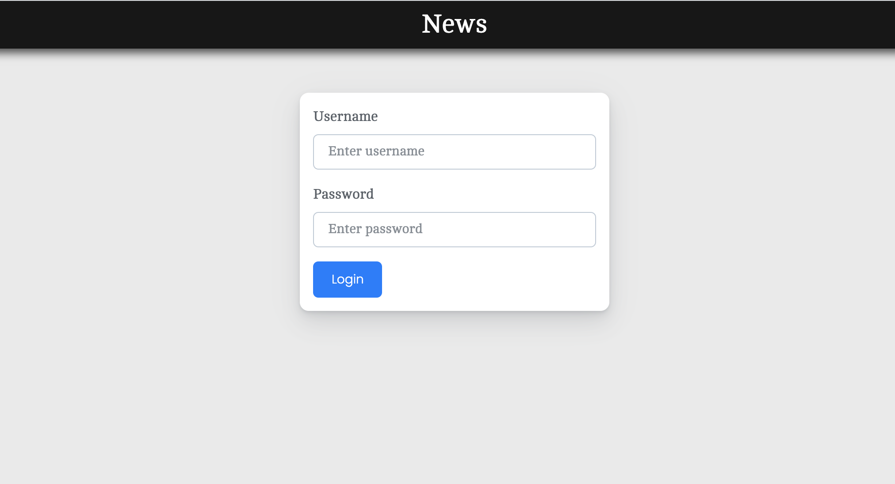
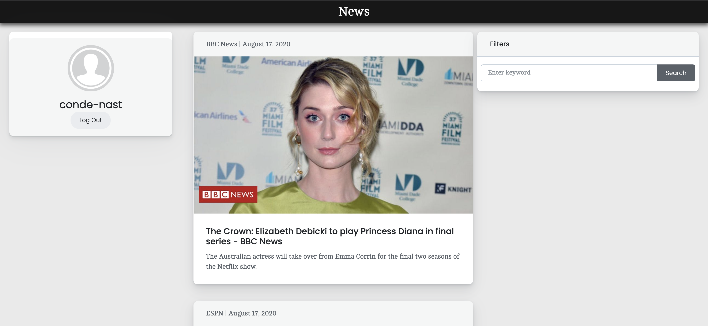

# News API Implementation  Node.js | LowDB | React JS | RESTful API


### Overview of the Application
* This web application allows the user to login and see the list of news with filter and logout feature





### List of Pages
* Login Page -> The user can login into the application
* List of News Articles with query filter 

## Development Steps

1. Clone the project from GitHub Repository and Install all the necessary packages

```sh
git clone  https://github.com/techierishi/newsapi-impl.git
cd newsapi-impl
npm install
```

2. Start both node and react using following command

```sh
npm run start:dev
```

4. Open your browser and go to [http://localhost:3000/](http://localhost:3000/)

### Tech Stack Used

* Node.js
* React JS
* RESTful API
* LowDB
